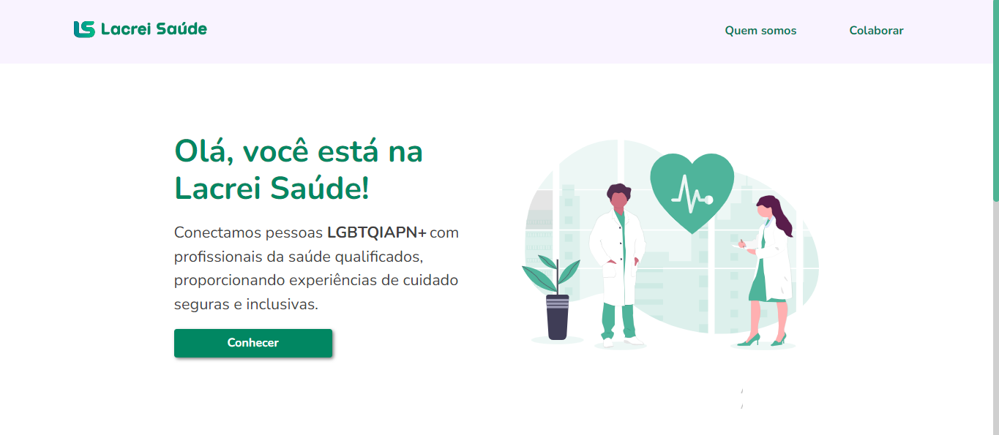

<h1 align="center"> Desafio Lacrei Saúde </h1>

<br>

<p align="center">
  
  
</p>
<p align="center">
  <em>Confira o resultado do app em: https://desafio-lacrei-hevelinlima.vercel.app/</em>
</p>

## 💻 Projeto

O Desafio Lacrei Saúde é uma aplicação web desenvolvida para a plataforma Lacrei Saúde, que visa proporcionar um acesso mais inclusivo à saúde para a comunidade LGBTQIAPN+. Este projeto envolve a criação de três páginas web interativas, com roteamento entre elas, respeitando as diretrizes de estilo da Lacrei Saúde.

## 🚀 Funcionalidades

- Header e Footer: Designs comuns a todas as páginas da aplicação.
- Três Botões(no footer): Cada um linkando diretamente com páginas das redes sociais da Lacrei Saúde. 
- Roteamento entre Páginas: Implementação de navegação suave entre as páginas desenvolvidas.
- Responsividade: Garantia de uma boa visualização em dispositivos móveis e desktops.

## 🛠️ Tecnologias Utilizadas

Este projeto foi desenvolvido com as seguintes tecnologias:

- HTML + CSS
- TypeScript
- Next.js
- Styled-Components
- Git e Github

## 📐 Processo de Desenvolvimento

- Configuração do Projeto:

  - Iniciação de um novo projeto Next.js com TypeScript.
  - Configuração do ambiente de desenvolvimento e integração com Git e Github.

- Desenvolvimento das Páginas:

  - Criação de três páginas web interativas.
  - Implementação de header e footer seguindo o guia de estilo da Lacrei Saúde.
  - Adição de três botões com funcionalidades específicas para navegação.

- Estilização:

  - Aplicação do style guide utilizando Styled-Components.
  - Garantia de coesão visual e acessibilidade.

- Responsividade:

  - Testes de visualização em diferentes dispositivos.
  - Ajustes de layout para garantir uma experiência consistente.

- Testes e Deploy:

  - Realização de testes de funcionalidade e responsividade.
  - Deploy da aplicação e verificação final.

## Execução do projeto
  
- Passo 1: Clone este repositório.
```bash
git clone https://github.com/hevelinlima/desafio-lacrei.git
```

- Passo 2: Navegue até o Diretório do Projeto:
````bash
cd desafio-lacrei
````

- Passo 3: Instale as Dependências:

  - Certifique-se de ter o Node.js e npm (ou yarn) instalados em sua máquina.
  - Instale as dependências do projeto executando:
  ````bash
  npm install
  ````
  ou
  ````bash
  yarn install
  ````

- Passo 4: Execute o Projeto:

Para iniciar o servidor de desenvolvimento, execute:
  ````bash
  npm run dev
  ````
  ou
  ````bash
  yarn dev
  ````

Agora que você clonou com sucesso o repositório e configurou as dependências do projeto localmente, você pode fazer alterações, desenvolver novos recursos e contribuir de volta para o repositório original quando estiver pronto.
    
---

Feito com ♥ by hevelinlima
